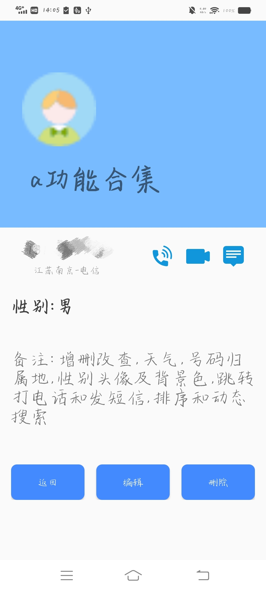
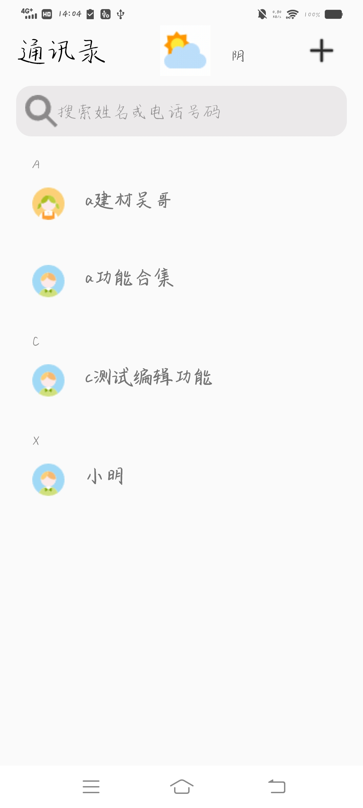
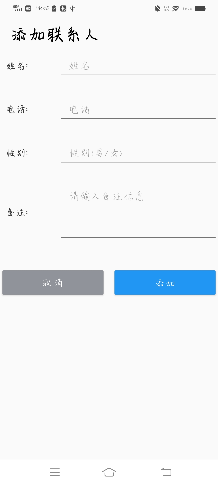
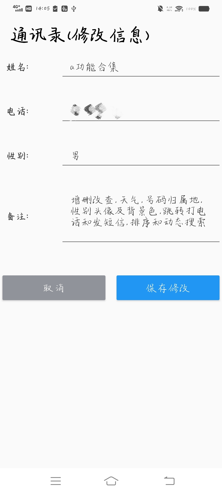
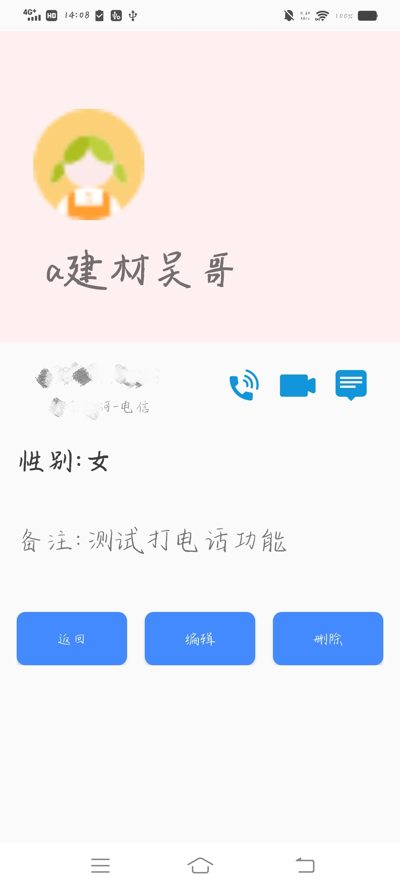
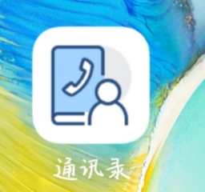

# 功能：

## 主界面：

* 排序，按字母分组；自动加载天气，并动图显示；按手机或者名字模糊查找；男女不同头像；添加功能

## 添加界面：

* 名字，电话，性别，备注进行人员添加

## 详情界面：

* 显示信息的字段；根据性别判断背景颜色，头像；查询号码的归属地；打电话；发短信；删除；编辑

## 编辑界面：

* 对人员名字，电话，性别，备注进行编辑，重新保存。

## 界面展示：
<div style="display: flex;gap:10px">
 

</div>
                         


<div style="display: flex;gap:10px">


</div>
                            

<div style="display: flex;gap:10px">
               

</div>


## 使用说明

因为获取天气，获取号码归属地等方式是网络请求。需要配置一下对应Api平台的key

这里使用的是[聚合数据](https://www.juhe.cn/)获取[天气](https://www.juhe.cn/docs/api/id/73)和[号码归属地](https://www.juhe.cn/docs/api/id/11)，[百度开发平台](https://lbsyun.baidu.com/faq/api?title=webapi/ip-api)获取ip 定位 

在对应平台注册好之后，找到ApiInfo，修改里面的值。在我的类里面，只用配置key就可以，（现在是2025.06）可以使用，如果后面发现接口调不了，自行阅读文档，进行微调，该踩的坑我都替你们踩过了，你们会很轻松的。

### ApiInfo类介绍

```
public class ApiInfo {
    public static String Apikey_phone; // 配置聚合平台的获取手机号码的key
    public static String urlPhone ="http://apis.juhe.cn/mobile/get";
    
    
    public static String urlSetKey; // 配置百度平台用于定位的key
    public static String urlSet ="https://api.map.baidu.com/location/ip?ip=&coor=bd09ll&ak=" + urlSetKey;
    
    public static String urlWeather ="http://apis.juhe.cn/simpleWeather/query";

    public static String WeatherKey; // 配置聚合平台的获取查询天气的key
}
```

将`Apikey_phone`、`urlSetKey`、`WeatherKey`改成你自己的key之后

恭喜你，可以启动项目了（一般不出问题就要出问题）。

具体可联系：siestajiong@gmail.com